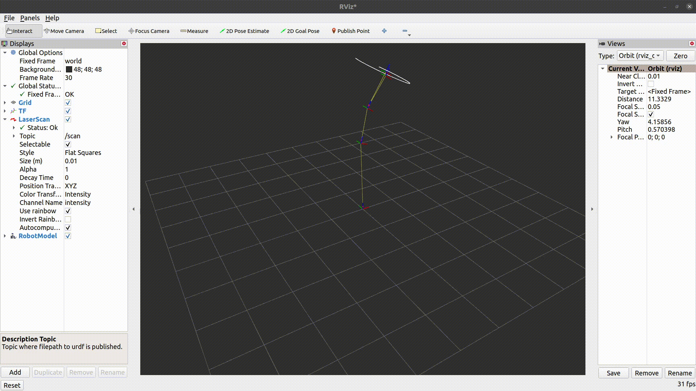
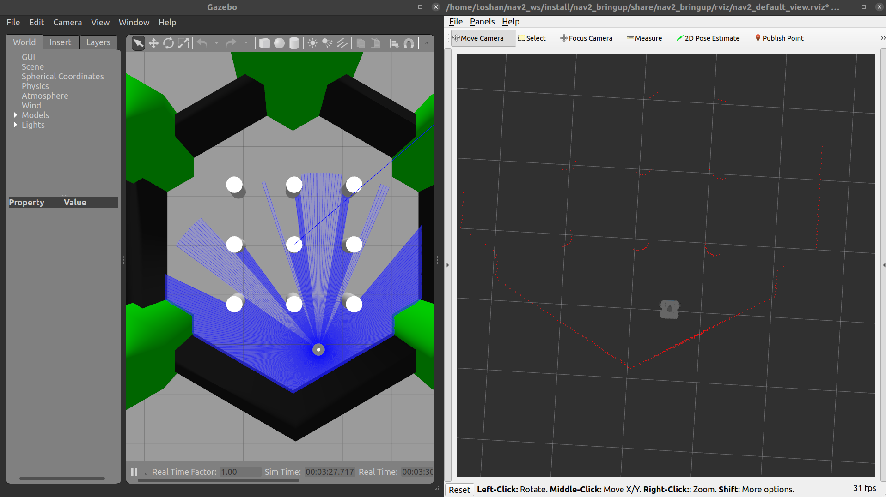

# Code for the JDE Robotics Tasks
Each task has its own subfolders with their respective READMEs  
The contents are as follows:
- **CPP**: Code for the C++ Challenge
- **Line_Follow**: Code for the JDERobotics Academy Challenge
- **talker_listener**: Code for Part a. of the ROS2 Challenge
- **Navigation**: Code for Part b. of the ROS2 Challenge
- **Python**: Code for the Python Challenge

## Output of the ROS2 Challenge Part a

I've used the dummy_robot that is provided alongwith ROS2 to demonstrate the Laser Scan

We can also see the Laser Scan visualization through the turtlebot

